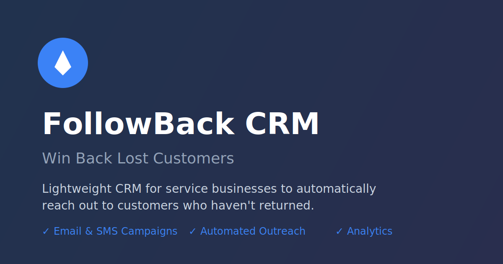

# FollowBack CRM

**Win back lost customers automatically with targeted email and SMS campaigns.**

FollowBack is a lightweight customer relationship management (CRM) tool designed specifically for service businesses like hair salons, auto shops, restaurants, and more. It helps you automatically identify customers who haven't returned and sends them personalized win-back campaigns.



## ✨ Features

- 📊 **Customer Database** - Import via CSV or add manually
- 📧 **Email Campaigns** - Automated email outreach with Resend
- 📱 **SMS Campaigns** - Text messaging via Twilio
- 🎯 **Smart Targeting** - Auto-tag customers as "at-risk" or "lost" based on visit history
- 📈 **Analytics Dashboard** - Track open rates, click rates, and recovered revenue
- 🔒 **Secure Authentication** - Powered by Clerk
- 💳 **Subscription Billing** - Stripe integration for Pro and Business plans
- ⚡ **Automated Triggers** - Cron jobs to send campaigns at the right time

## 🚀 Quick Start

### Prerequisites

- Node.js 18+ and npm
- A Supabase account (free tier works)
- A Clerk account (free tier works)
- A Resend account for email (free tier: 100 emails/day)
- A Twilio account for SMS (optional)
- A Stripe account for payments (optional, for subscriptions)

### 1. Clone and Install

```bash
git clone https://github.com/ahoque32/followback.git
cd followback
npm install
```

### 2. Environment Variables

Copy `.env.example` to `.env.local`:

```bash
cp .env.example .env.local
```

Fill in your credentials:

```env
# Clerk (Authentication)
NEXT_PUBLIC_CLERK_PUBLISHABLE_KEY=pk_test_...
CLERK_SECRET_KEY=sk_test_...
NEXT_PUBLIC_CLERK_SIGN_IN_URL=/sign-in
NEXT_PUBLIC_CLERK_SIGN_UP_URL=/sign-up

# Supabase (Database)
NEXT_PUBLIC_SUPABASE_URL=https://your-project.supabase.co
NEXT_PUBLIC_SUPABASE_ANON_KEY=your-anon-key
SUPABASE_SERVICE_ROLE_KEY=your-service-role-key

# Resend (Email)
RESEND_API_KEY=re_...

# Twilio (SMS - Optional)
TWILIO_ACCOUNT_SID=AC...
TWILIO_AUTH_TOKEN=...
TWILIO_PHONE_NUMBER=+1234567890

# Stripe (Payments - Optional)
STRIPE_SECRET_KEY=sk_test_...
NEXT_PUBLIC_STRIPE_PUBLISHABLE_KEY=pk_test_...
STRIPE_WEBHOOK_SECRET=whsec_...

# Cron Secret (for scheduled tasks)
CRON_SECRET=your-random-secret-string
```

### 3. Set Up Supabase Database

Run the SQL migrations in `supabase/migrations/` in order:

1. `20240101000000_create_businesses.sql`
2. `20240101000001_create_customers.sql`
3. `20240101000002_create_campaigns.sql`
4. `20240101000003_create_messages.sql`

Or use the Supabase CLI:

```bash
# Install Supabase CLI
npm install -g supabase

# Link your project
supabase link --project-ref your-project-ref

# Push migrations
supabase db push
```

### 4. Configure Clerk

1. Go to [clerk.com](https://clerk.com)
2. Create a new application
3. Enable email/password authentication
4. Add these environment variables to Clerk Dashboard → API Keys
5. Set up the webhook endpoint (optional): `https://your-domain.com/api/clerk/webhook`

### 5. Configure Resend

1. Go to [resend.com](https://resend.com)
2. Create an API key
3. Verify your domain (or use their test domain for development)
4. Add `RESEND_API_KEY` to your `.env.local`

### 6. Configure Twilio (Optional)

1. Go to [twilio.com](https://twilio.com)
2. Get a phone number
3. Copy your Account SID, Auth Token, and Phone Number
4. Add to `.env.local`

### 7. Run Development Server

```bash
npm run dev
```

Open [http://localhost:3000](http://localhost:3000) to see the app.

## 📦 Database Schema

### `businesses`
- Business info, plan type, customer/campaign limits
- Created automatically when user signs up

### `customers`
- Customer records with name, email, phone, visit history
- Auto-tagged as "at-risk" (14+ days) or "lost" (30+ days)

### `campaigns`
- Campaign templates with trigger days, channel, message, discount
- Can be active/inactive

### `messages`
- Individual messages sent to customers
- Tracks sent_at, opened_at, clicked_at for analytics

## 🎯 How It Works

1. **Import Customers** - Upload a CSV or add customers manually
2. **Create Campaigns** - Set trigger (e.g., 30 days since last visit), channel (email/SMS/both), message template
3. **Automated Sending** - Cron job runs hourly, identifies customers matching campaign triggers, sends personalized messages
4. **Track Results** - View analytics on open rates, click rates, and recovered customers

## 🔄 Cron Setup

For automated campaign sending, set up a cron job to hit your API endpoint:

### Local Development (for testing)

```bash
# Run manually
curl -X POST http://localhost:3000/api/cron/check-campaigns \
  -H "Authorization: Bearer your-cron-secret"
```

### Production (Vercel)

Use Vercel Cron Jobs (in `vercel.json`):

```json
{
  "crons": [
    {
      "path": "/api/cron/check-campaigns",
      "schedule": "0 * * * *"
    }
  ]
}
```

Or use an external cron service like [cron-job.org](https://cron-job.org):

```bash
curl -X POST https://your-app.vercel.app/api/cron/check-campaigns \
  -H "Authorization: Bearer your-cron-secret"
```

See `CRON_SETUP.md` for detailed instructions.

## 💳 Stripe Subscription Setup

1. Create products in Stripe Dashboard:
   - **Pro Plan**: $29/month, 500 customers, 20 campaigns
   - **Business Plan**: $79/month, 2000 customers, 100 campaigns

2. Add price IDs to your code (search for `price_` in the codebase)

3. Set up webhook endpoint: `https://your-domain.com/api/stripe/webhook`
   - Listen for: `checkout.session.completed`, `customer.subscription.updated`, `customer.subscription.deleted`

4. Test with Stripe CLI:

```bash
stripe listen --forward-to localhost:3000/api/stripe/webhook
```

## 📊 Plans & Limits

| Feature | Free | Pro ($29/mo) | Business ($79/mo) |
|---------|------|-------------|-------------------|
| Customers | 50 | 500 | 2,000 |
| Campaigns | 3 | 20 | 100 |
| Email | ✅ | ✅ | ✅ |
| SMS | ✅ | ✅ | ✅ |
| Analytics | ✅ | ✅ | ✅ |
| Support | Community | Email | Priority |

## 🛠️ Tech Stack

- **Framework**: Next.js 14.2 (App Router)
- **Database**: Supabase (PostgreSQL)
- **Auth**: Clerk
- **Email**: Resend
- **SMS**: Twilio
- **Payments**: Stripe
- **Styling**: Tailwind CSS
- **Charts**: Recharts
- **Hosting**: Vercel

## 📁 Project Structure

```
followback/
├── app/
│   ├── (public)/          # Landing page (unauthenticated)
│   ├── (protected)/       # Dashboard (requires auth)
│   │   └── dashboard/
│   │       ├── page.tsx           # Main dashboard
│   │       ├── customers/         # Customer management
│   │       ├── campaigns/         # Campaign creation
│   │       └── analytics/         # Analytics & reports
│   ├── api/
│   │   ├── cron/          # Scheduled tasks
│   │   ├── send-email/    # Email sending endpoint
│   │   ├── send-sms/      # SMS sending endpoint
│   │   ├── stripe/        # Stripe checkout & webhooks
│   │   └── waitlist/      # Waitlist signup
│   └── layout.tsx         # Root layout (Toaster, metadata)
├── components/            # Reusable UI components
├── lib/                   # Utilities (Supabase client, helpers)
├── emails/                # Email templates (React Email)
├── supabase/migrations/   # Database migrations
└── public/                # Static assets (favicon, OG image)
```

## 🧪 Testing

### Test Email Sending

```bash
curl -X POST http://localhost:3000/api/send-email \
  -H "Content-Type: application/json" \
  -d '{
    "to": "test@example.com",
    "customerName": "John Doe",
    "businessName": "Test Business",
    "discountPercent": 15,
    "bookingLink": "https://example.com"
  }'
```

### Test SMS Sending

```bash
curl -X POST http://localhost:3000/api/send-sms \
  -H "Content-Type: application/json" \
  -d '{
    "to": "+1234567890",
    "message": "Test message"
  }'
```

### Test Cron Job

```bash
./test-cron.sh
```

## 🚢 Deployment

### Deploy to Vercel

1. Push your code to GitHub
2. Import project in Vercel
3. Add all environment variables
4. Deploy!

```bash
# Or use Vercel CLI
npm install -g vercel
vercel --prod
```

### Post-Deployment Checklist

- ✅ Test authentication (sign up, sign in, sign out)
- ✅ Add a test customer
- ✅ Create and activate a test campaign
- ✅ Verify email/SMS sending works
- ✅ Test Stripe checkout (use test mode)
- ✅ Set up cron job for automated campaigns
- ✅ Check analytics dashboard

## 🤝 Contributing

Contributions are welcome! Please open an issue or submit a pull request.

## 📄 License

MIT License - feel free to use this for your own projects!

## 🙏 Credits

Built with love for service businesses everywhere. Special thanks to:
- [Next.js](https://nextjs.org)
- [Supabase](https://supabase.com)
- [Clerk](https://clerk.com)
- [Resend](https://resend.com)
- [Twilio](https://twilio.com)

## 📞 Support

- 📧 Email: support@followback.app
- 💬 Discord: [Join our community](#)
- 📖 Docs: [Read the full guide](IMPLEMENTATION_SUMMARY.md)

---

Made with ❤️ for small businesses
